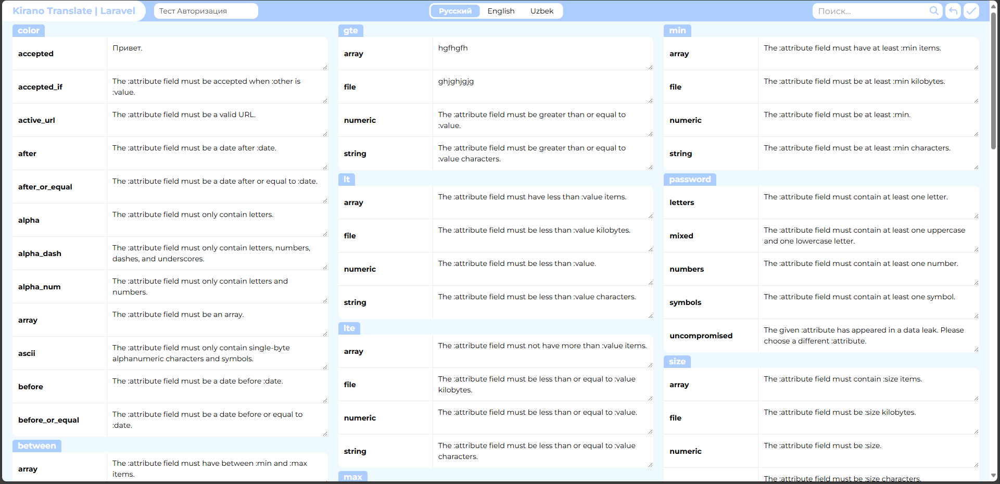

# Laravel Translation panel

<p align="center"></p>


## Getting Started

You can download the package via composer:

```bash
composer require monosniper/laravel-translatable
```

Then run installation command:

```bash
php artisan laravel-translatable:install
```

Also you need to add /livewire/* path in csrf protection except array (bootstrap/app.php):

```php
$middleware->validateCsrfTokens(except: [
    ...
    'livewire/*',
]);
```

## Changelog

Please see [CHANGELOG](CHANGELOG.md) for more information on what has changed recently.

## Contributing

Please see [CONTRIBUTING](CONTRIBUTING.md) for details.

## Security Vulnerabilities

Please review [our security policy](../../security/policy) on how to report security vulnerabilities.

## Credits

- [ravilto](https://github.com/monosniper)
- [All Contributors](../../contributors)

## License

The MIT License (MIT). Please see [License File](LICENSE.md) for more information.
